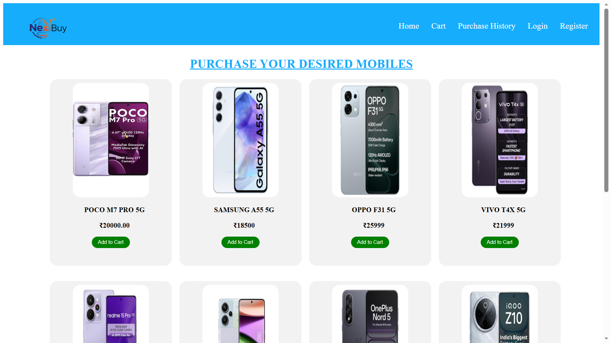
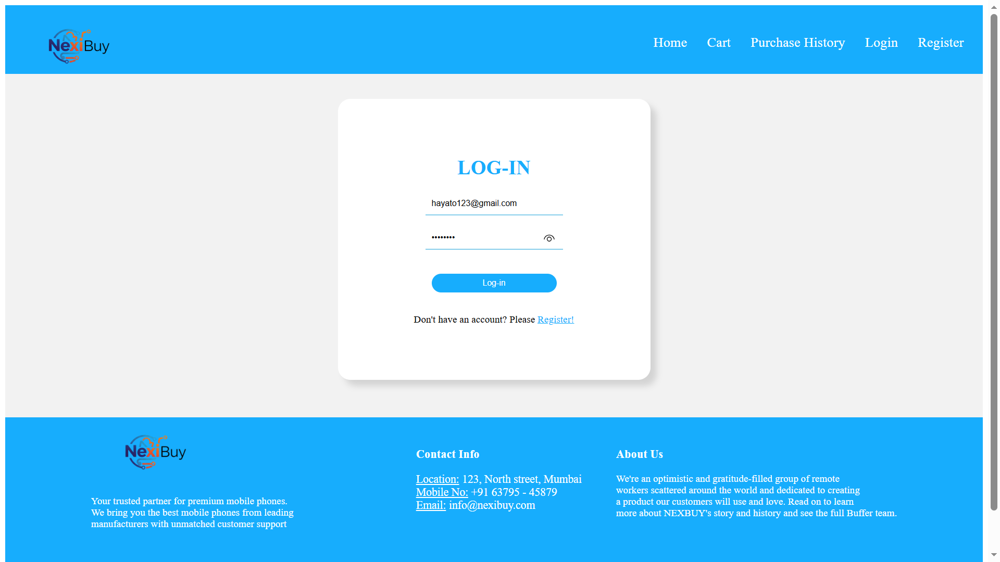
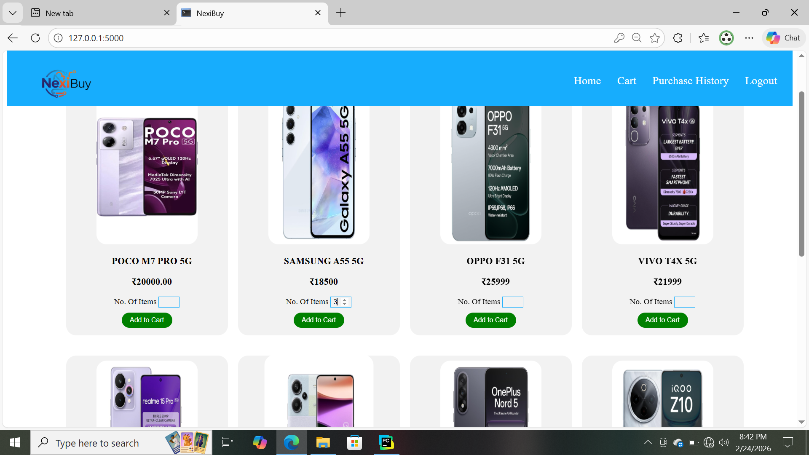
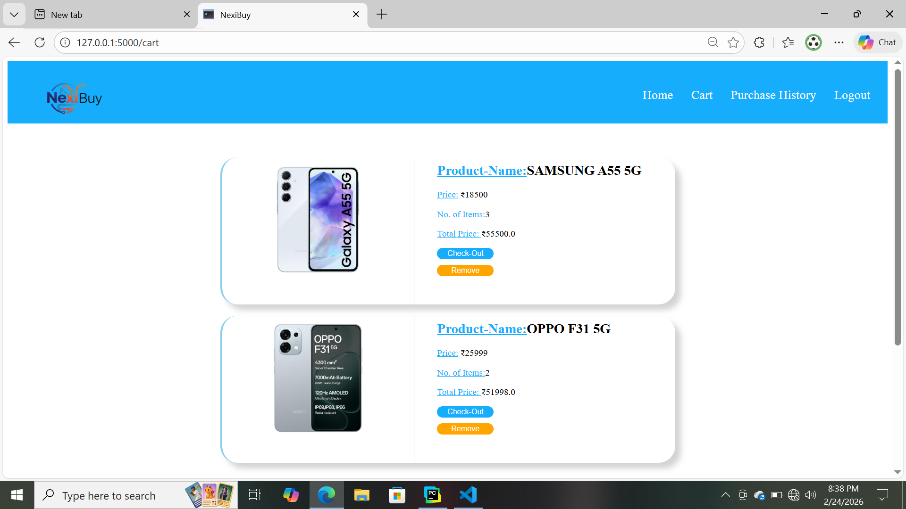
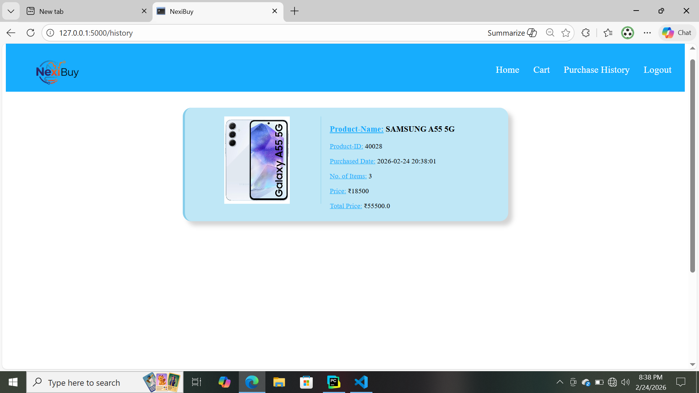
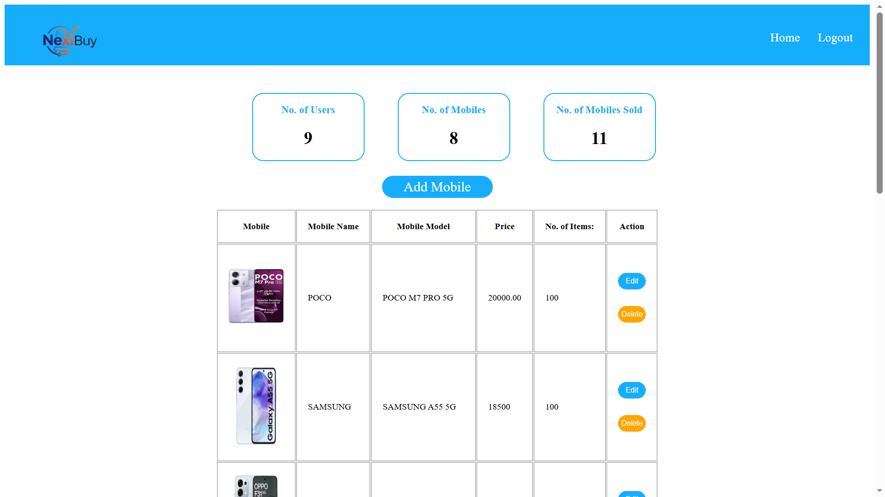

# 📱 Mobile Shopping Web Application

An internship project developed to build a fully functional mobile shopping web application using Flask and MySQL.  
The application allows users to browse products, add items to cart, and place orders efficiently.

---

## 🚀 Project Overview

This web application simulates a real-world mobile e-commerce platform.  
It includes user authentication, product management, cart functionality, and order processing.

Developed as part of my internship to demonstrate full-stack web development skills.

---

## 🛠️ Technologies Used

- HTML5
- CSS3
- JavaScript
- Python (Flask Framework)
- MySQL Database

---

## ✨ Features

### 👤 User Module
- User Registration
- User Login & Logout
- Secure Session Management
- Browse Products
- Add to Cart
- Update Cart Quantity
- Remove Items from Cart
- Place Orders

### 🛒 Shopping Module
- Product Listing Page
- Product Details
- Cart Total Calculation
- Order Confirmation

### 🔐 Admin Module
- Admin Login
- Add / Edit / Delete Products
- View All Orders

---

## 📸 Screenshots

### 🏠 Home Page

### 🔑 Login Page

### 🛍️ Product Listing

### 🛒 Cart Page

### ✅ Order Confirmation

### 🛠️ Admin Dashboard

---

## ⚙️ How to Run Locally

1. Install Python (3.x)
2. Install required packages:
3. Configure MySQL database and update database credentials in the project.
4. Run the Flask application:
5. Open browser and go to: http://127.0.0.1:5000/

---

## 📂 Project Type

Academic Internship Project  

---

## 📌 Note

This project was developed for academic purposes and runs locally using Flask and MySQL.  
It demonstrates full-stack development concepts including authentication, CRUD operations, and database integration.

---
